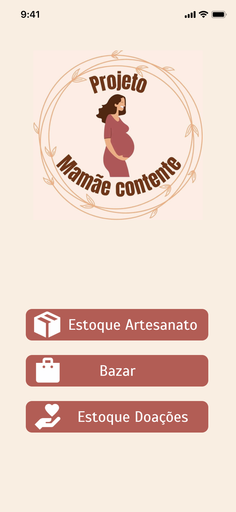
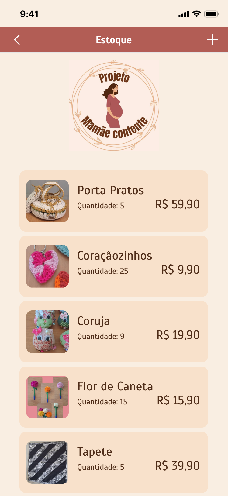
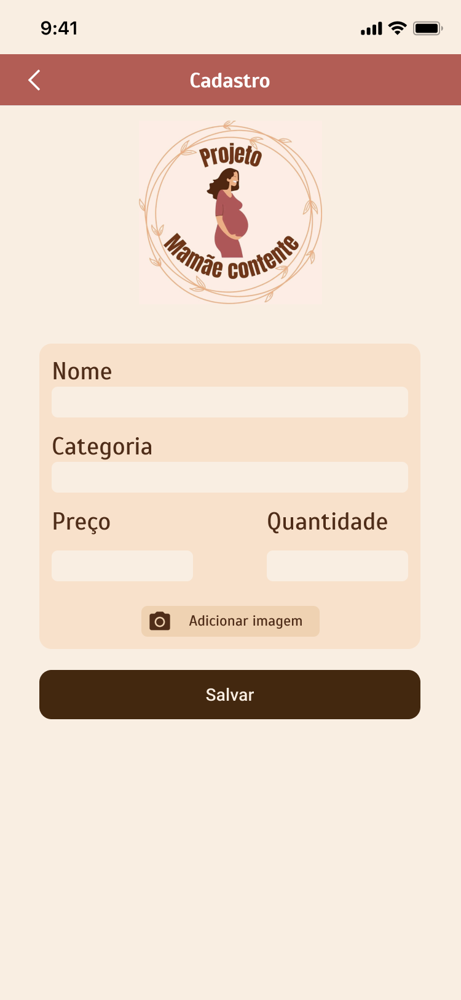
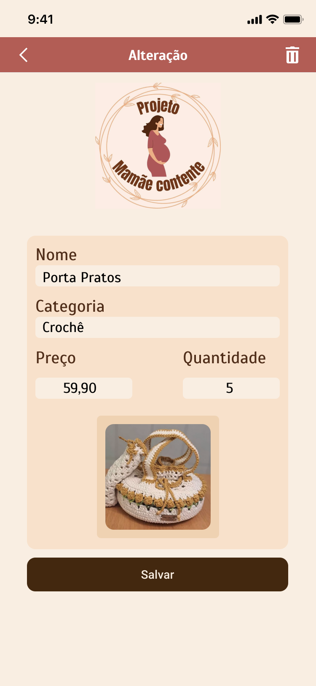
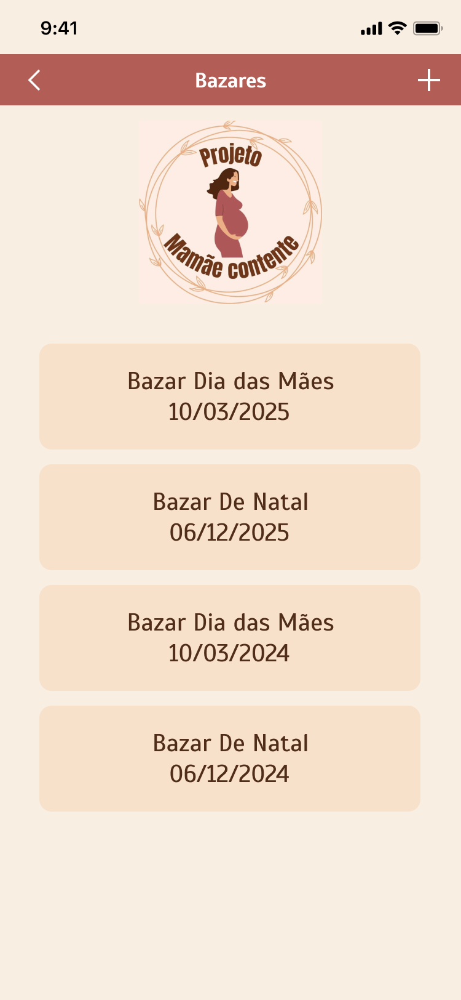
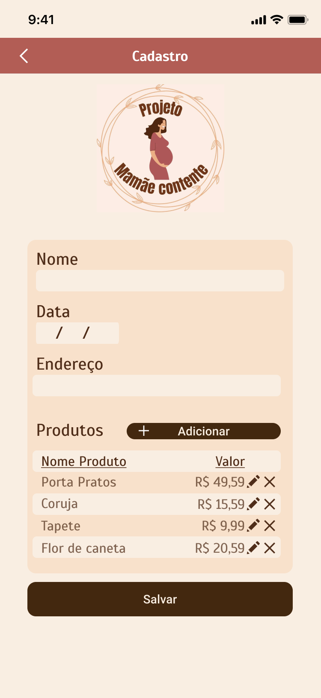
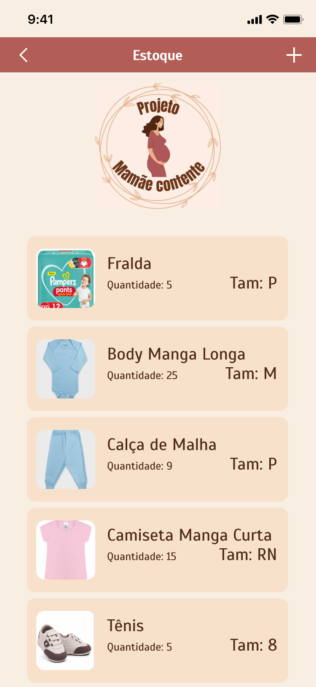
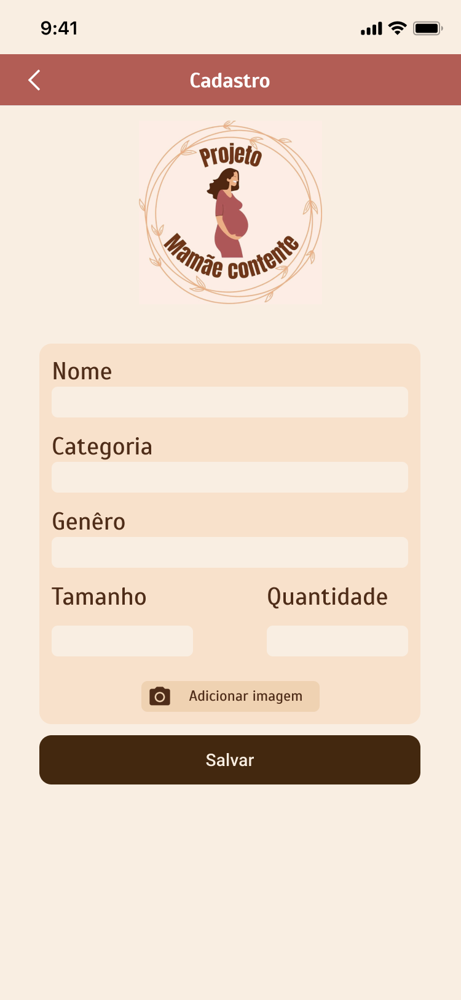
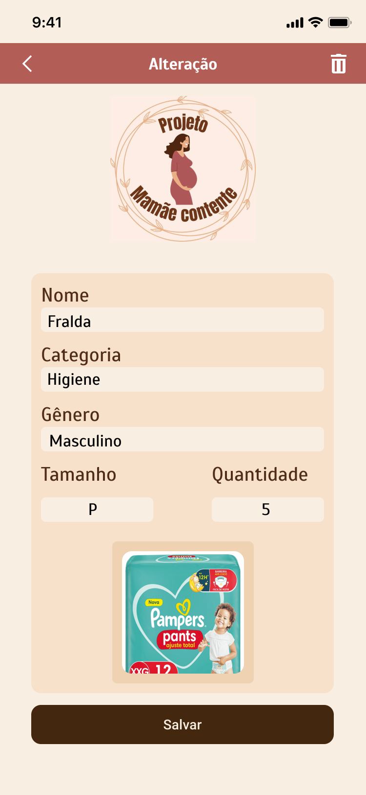

# Protótipos de Alta Fidelidade (UI/UX)

**Ferramenta:** Figma  
**Status:** Aprovado para Desenvolvimento (v1.0)

## Acesso ao Projeto
Para visualizar o fluxo interativo, inspecionar CSS e exportar assets, acesse o link abaixo:

**[Clique aqui para abrir o Projeto Mamãe Contente no Figma](https://www.figma.com/design/ByBtmAuWBHcbludPVqS1yL/m%C3%A3e-Contente?node-id=0-1&t=kZrGksSiSuiK7DwZ-1)**

---

## Snapshots da Versão 1.0
Abaixo estão as telas congeladas que foram utilizadas como base para o desenvolvimento da versão 1.0. 

### Fluxo de Estoque Artesanato
| Home | Listagem | Cadastro | Edição |
| :---: | :---: | :---: | :---: | 
|  |  |  |  |

### Fluxo do Bazar
| Home | Listagem | Cadastro |
| :---: | :---: | :---: | 
|  |  |  |

### Fluxo de Doação
| Home | Listagem | Cadastro | Edição |
| :---: | :---: | :---: | :---: |
|  |  |  |  |